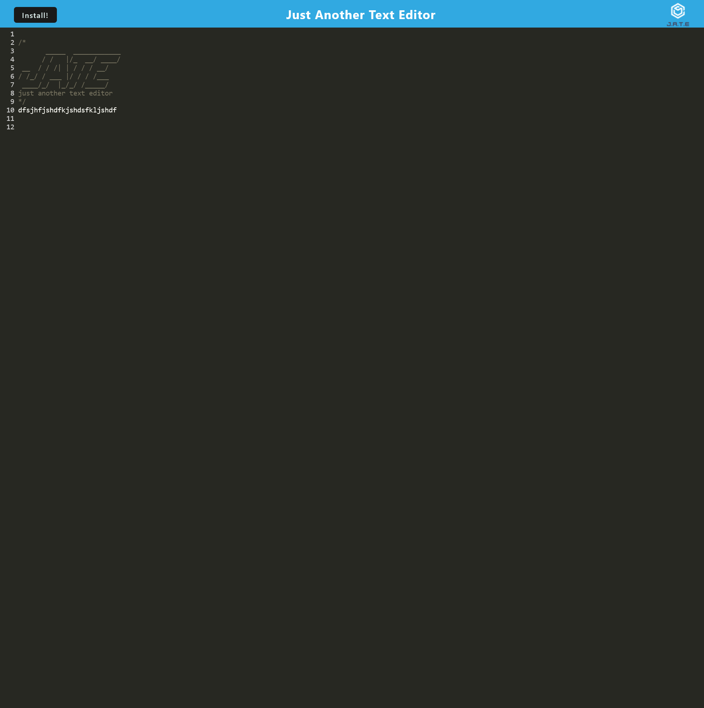
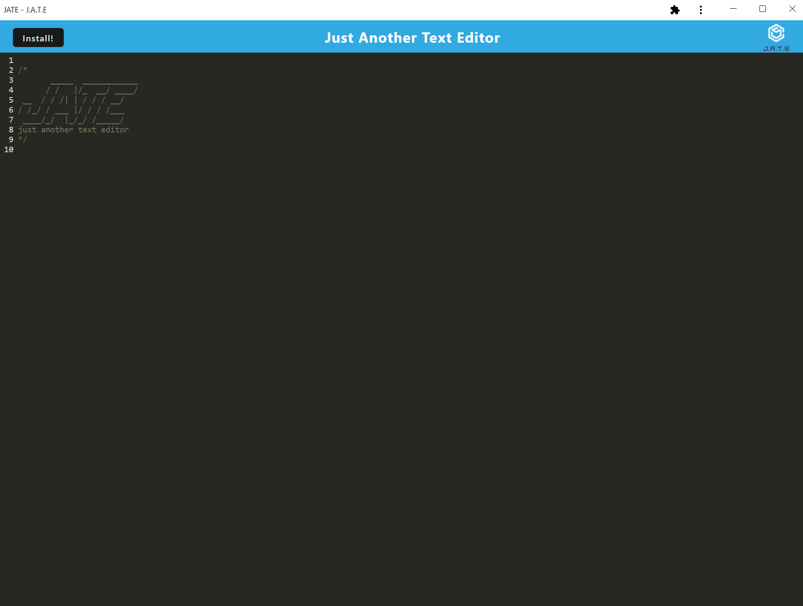

# Text Editor Starter Code

A text editor that runs in the browser. The app will be a single-page application that meets the PWA(progressive web application) criteria. Additionally, it will feature a number of data persistence techniques that serve as redundancy in case one of the options is not supported by the browser. The application will also function offline.

## Table of Contents 📃

1. [Description](#description)
2. [Screenshot](#screenshots)
3. [Installation](#installation)
4. [Usage](#usage)
5. [Video Walk Through](#video-walk-through)
6. [Technology](#technology)
7. [Features](#features)
8. [Credits](#credits)
9. [License](#license)
10. [Contribution Guidelines](#contribution-guidelines)
11. [Feedback](#feedback)
12. [Socials](#socials)

## Description

I had to go in and implement the features of a progressive web application for a text editor application. This involved editing and setting up the webpack config, installing dependencies that will help with the build of the app and PWA and more.

[Link to application](https://pacific-shore-70716.herokuapp.com/)

### User Story 👤

AS A developer
I WANT to create notes or code snippets with or without an internet connection
SO THAT I can reliably retrieve them for later use

### What did I Learn 🏫

There was a lot that I learned.

Specifically:

- More about how the client server folder structure works.
- How to bundle and build applications using Webpack.
- How to use various webpack plugins to help with the build process such as.
- How to make a PWA which can work offline.
- How to use IndexedDB to save data for a PWA.
- How to use service workers to cache content for the application.

## Screenshots

### Web App Screenshot

### PWA Screenshot

## Installation

In order to install this social-network API please follow these steps:

1. Ensure that you have node and npm installed

   - [Download Node](https://nodejs.org/en/download/)

   - For detailed instructions on installing node please follow [this link](https://docs.npmjs.com/downloading-and-installing-node-js-and-npm) for instructions

2. Clone this repository into your local repository.

   - `git clone git@github.com:TheInfamousGrim/Progressive-Web-Application-Text-Editor.git`.

3. Install the dependencies

   - `npm install`

If you've followed these steps correctly then the application should be good to go 😁

## Usage

Link to live application: [Click here](https://pacific-shore-70716.herokuapp.com/)

Please follow these steps to use the application locally

1. Seed the db.

   - `npm run start`

2. open a new tab in google chrome using the following URL

   - `http://localhost:3001/`

## Technology

The technology used for the development of this app was:

## Features

- Uses express.js to create and run a server
- Use REST API structure to manipulate data
- Allows user to create, update, get and manipulate user data such as a friend list or users thoughts and reactions

## Credits

🙏 Made with the help of:

- [University of Birmingham Coding Bootcamp](https://www.birmingham.ac.uk/postgraduate/courses/cpd/coding-boot-camp.aspx)

## License

[MIT License](/LICENSE)

## Contribution Guidelines

I'm open to have anyone jump in and contribute just message me on [twitter](https://twitter.com/VaporWhy)

Please follow the contribution guidelines!
[Guidelines for contributing](/code_of_conduct.md)

## Feedback

Any feedback please email [George Fincher](mailto:finchergeorge1@gmail.com)

## Socials

GitHub: [TheInfamousGrim](https://api.github.com/users/TheInfamousGrim)

